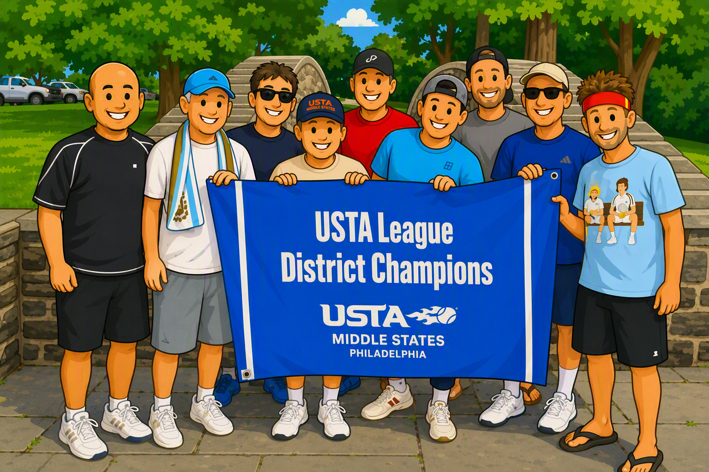
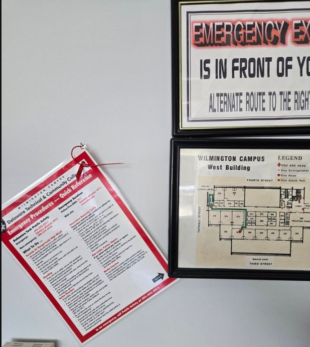
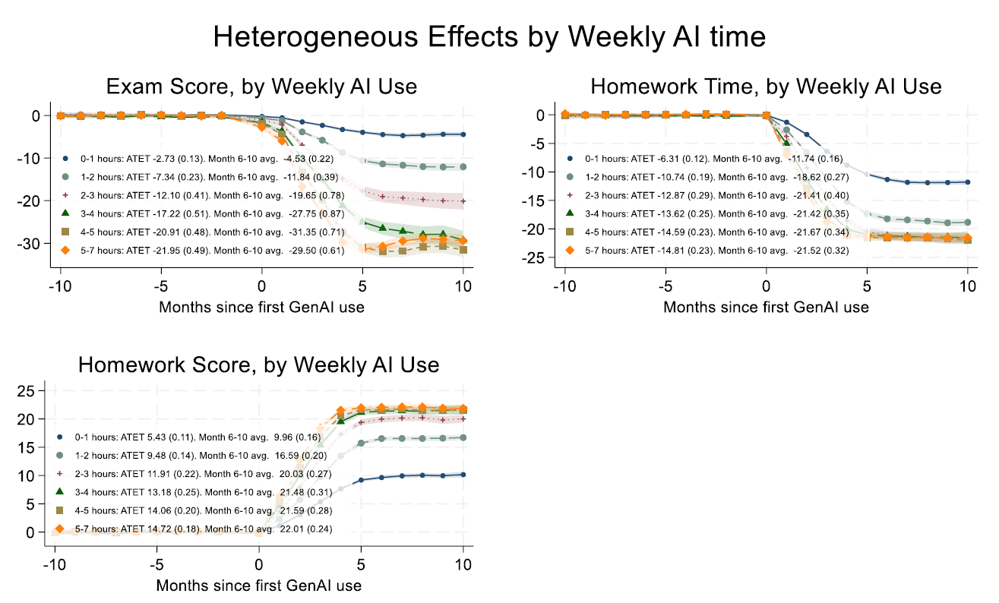

# Intro to CSC164
## Computer Science II

<!-- footer -->
Delaware Technical Community College

---

# Introductions

- About me
- About you
- About the course
---

# Me

<!-- column -->
- [LinkedIn: Jin An](https://www.linkedin.com/in/jinsungpsu/)
- Family
- Technology
- Sports (playing/watching)

<!-- column -->

---

# You

- Preferred name
- Major
- Memorable thing from break
- What makes you happy?
    - Hobbies? Favorite game/show/food?

---

# In case of emergency…

<!-- column -->

- Public Safety
- https://www.dtcc.edu/about/public-safety/
- Wilmington: (302) 552-5911

<!-- column -->

---

# Resources

- Alerts
    - https://dtcc.app.regroup.com/
- Student Support Center
    - https://www.dtcc.edu/support
- Students in Need
    - https://www.dtcc.edu/student-resources/need/
- Public Safety
    - https://www.dtcc.edu/about/public-safety

---

# Classroom Expectations

---

# Ground Rules

## Be respectful and professional

- Be respectful of your classmates and instructor.

## Focus on your goals

- Think about your goals for this course and your future career.
- Put yourself in the best position to succeed.

## Communicate early

- If something comes up, let me know as early as possible so we can work together on a solution.
---

# Scenarios

Common situations where communication matters:

- Need to miss class?
- Need to submit an assignment late?
- Have a conflict with an upcoming exam?
- Need to step out briefly?
- Expecting an important phone call?
- Have a question about the topic we're discussing?

---

# Course Communication

- D2L (announcements, sign up for notifications)
- Emails

---

# Communication Plan and Expectations

- preferred: jin.an@dtcc.edu (replies within 24 hours on weekdays)
- 302-223-9494 (text messages are OK, but don’t expect instant replies)
- https://calendly.com/jinandtcc
    - Appointments on Zoom, phone, or in person at WW363

---

# Class Format

- Lecture
- Discussion
- Coding demo
- Hands on coding
- Lab time

---

# Course Resources

- Github code repository
- Me
- You
- [Google](https://lmgtfy.app/?q=how+do+i+write+a+loop), Stack Overflow, YouTube, etc.

---

# What about generative AI
## (ChatGPT, Gemini, Meta AI, etc.)

<!-- column -->
- So what do you do with this technology?
- It's a tool
- In your context, it's a learning tool

<!-- column -->

---

# Closed Resource Exams
In this course, there will be closed resource exams during class
---

# AI Effect on Exams
> Students who use AI score great on homework, but bad on tests: large-scale new study
- https://nypost.com/2026/08/19/world-news/students-who-use-ai-score-great-on-homework-but-bad-on-tests-study/
- https://papers.ssrn.com/sol3/papers.cfm?abstract_id=6868618

---
# AI Use Study Summary

---

# Academic Integrity

- [DTCC Student Handbook / Academic Integrity](https://dtcc.smartcatalogiq.com/Current/Catalog/Academics/Academic-Integrity)

---

# Most common in our department

- Cheating and Plagiarism

---

# Cheating

Cheating is an act of deception by which a student misrepresents that he or she has mastered information on an academic exercise that he or she has not mastered.

- Using and/or copying from another student's work such as test paper, project, or computer program.
- Allowing another student to copy one’s work.
- Using unauthorized materials such as a textbook, notebook, cell phone or other technology/materials during testing or competency performance without permission.
- Collaborating during a test or competency performance without permission.
- Using specifically prepared materials that are not permitted during a test.

---

# Plagiarism

Plagiarism is the inclusion of someone else's words, ideas, or data as one's own work.

- Whenever quoting another person's words.
- Whenever using another person's idea, opinion, or theory.
- Whenever borrowing facts, statistics, computer programs, or other illustrative materials unless the information is common knowledge.

---

# It's OK to work together!

- But you still have to write your own code
- No emailing whole programs
- No copy/paste
- Understand everything you are handing in
- When in doubt, cite and/or contact instructor

---

# What's the goal here?

- Learning!
- I am not here to "get you."
- I am not actively trying to find academic integrity infractions.

---

# Don't put yourself in that position...

- Students who cheat are often stressed and desperate because they waited too long to complete an assignment.
- Start your work early.
- Communicate with your instructor.

---

# Very obvious red flags

...

---

# Course Introduction

## Welcome to CSC164
### Computer Science II

---

# Technology

- IntelliJ Community Edition
- JDK

---

# Review in D2L Brightspace

- Homepage
    - Announcements

- Getting Started Module
    - Instructor info
    - Syllabus
    - Course policies
        - ***Late policy: 15% penalty per week, up to 2 weeks***
            - **If there are extenuating circumstances, communicate them ASAP**
    - Evaluation Measures & Grading Breakdown
    - Course Schedule

---

# What's this course about?

## Semester Overview

- Semester will be roughly in 3 sections
    - Review, transition to Java
    - Object Oriented Programming
    - Graphical User Interfaces / JavaFX