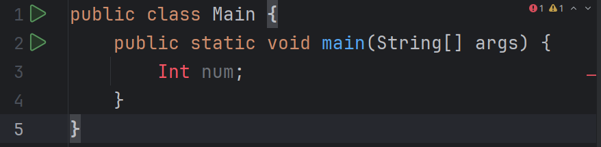
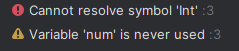
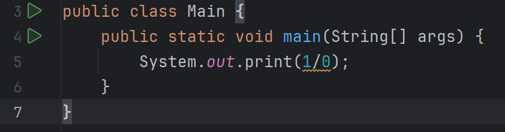
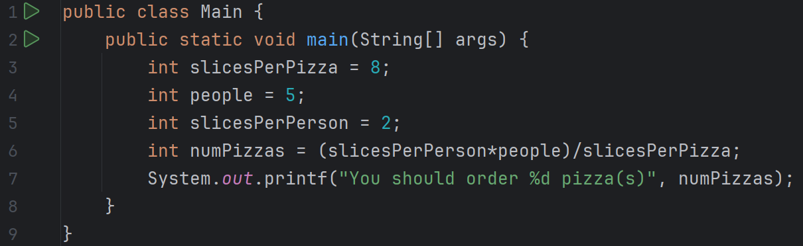

# Java Errors
<!-- footer -->
Delaware Technical Community College

---

# Deciphering errors
- Syntax Errors
    - Detected by the compiler
- Runtime Errors
    - Causes the program to abort
- Logic Errors
    - Produces incorrect result

---

# As opposed to warnings
- Red = stop
- Yellow = caution
- will still compile, but IDE is warning you to check for *possible* issues


---

# Syntax - IDE
- Red = bad, but normally easy to fix, since you know exactly where the error is
- The color coding is done by the IDE - not the compiler


---

# Syntax - Compiler
- Syntax errors = cannot compile

```text
C:\Project\src\Main.java:3:9
java: cannot find symbol
symbol:   class Int
location: class Main
```

- Exact location of error
    - File: Main.java
    - Line: 3
    - Column: 9

---

# Runtime
- Compiles, runs, and terminates unexpectedly


---

# Logic
- Compiles, runs, but incorrect behavior/results
    - Output: You should order 1 pizza(s)
        - Expected result.  If 5 people need 2 slices each, you’d need 10 slices, so order 1 pizza would be a problem.

