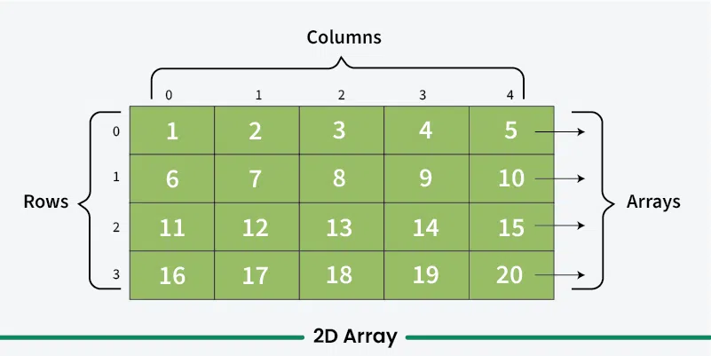
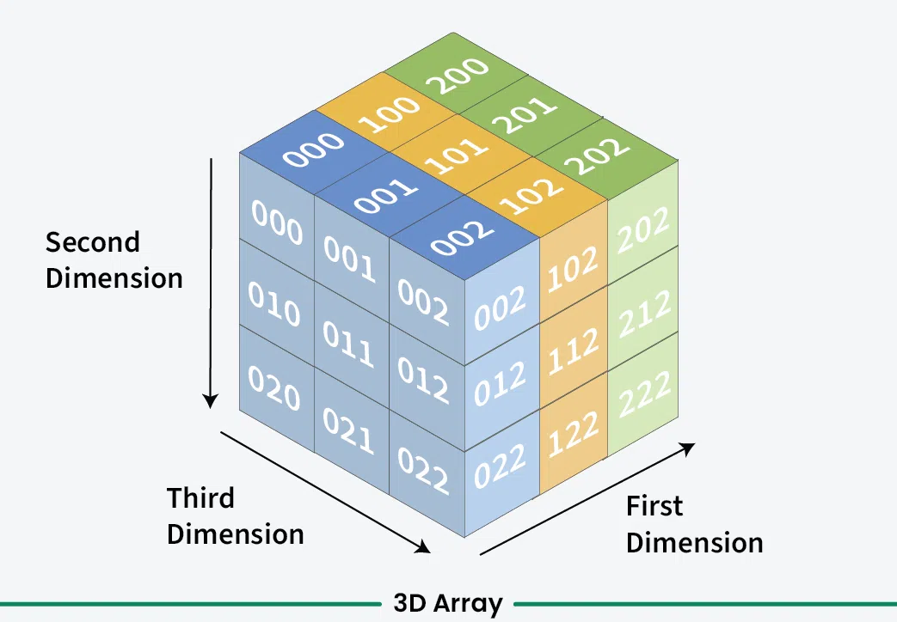

# Arrays

---

# What is an array?

An array is a data structure in programming that stores a collection of similar data items (like numbers or strings) in a contiguous memory location, allowing you to access each item individually using a unique index number, essentially acting like a numbered list where you can easily retrieve specific values based on their position within the array.

---

# Contiguous Memory Locations

Imagine RAM is like an apartment building, and each apartment is a memory location.

- Building (RAM): The entire building is your computer's memory (RAM).
- Apartment (Memory Location): Each apartment in the building is a specific location in memory where data can be stored. Each apartment has its own unique number (address).
- Room Number (Memory Address): The number on each apartment door is like the memory address. When you want to store or retrieve something, you simply go to the apartment with the specific number (memory address).
- Consecutive Apartments (Contiguous Memory): In an array, the apartments are numbered one after the other, so the first apartment is right next to the second, and so on. This makes it easy to find each apartment (or data) in order.

---

# Why use it?

```java
int num1;
int num2;
int num3;
```

NOPE, instead, do:

```java
int[] nums = new int[3];
```

---

# Big picture…

- Programming constructs are provided so you can write “better” code
- code that is highly readable, easily maintainable, well-structured, efficient, and reliable, meaning it is simple to understand, can be easily modified in the future, and functions correctly across various scenarios, essentially prioritizing clarity and adaptability over complex solutions.
- Just because something works, it doesn’t mean we cannot improve it!
- Refactoring is an important skill
- the process of restructuring existing computer code without changing its functionality or behavior. It's a key skill for software developers that can help improve the quality, readability, and maintainability of code.

---

# Syntax for java

- dataType[ ] identifier = new dataType[ arrayLength ];
- dataType identifier[ ] is allowed, but not preferred for java naming conventions

Examples:

```java
int[] numbers = new int[5];
String[] names = new String[10];
```

---

# Array lengths

- Arrays elements are stored in contiguous memory locations (RAM), so a length is REQUIRED in order to pre-allocate the memory for all possible elements that can be stored in the array, regardless of what is actually stored at any given moment

---

# Initializing with an implicit length

```java
int[] nums = {1,2,3};
// initializes it with values 1,2,3
String[] names = {“John”, “Alice”};
```

** This syntax can only be done in one line - when the array is defined. You cannot do:

```java
int[] nums;
nums = {1,2,3};
```

---

# Arrays are immutable in length

- Once the length is set, you CANNOT make it smaller/bigger

---

# Array Length

- Array length can be accessed via
- arrayName.length
- This did not exist in C++

---

# Runtime size allocation

- this also does not exist in C++
- you can create an array during runtime!

```java
int arraySize = keyboard.nextInt();
int[] array = new int[arraySize];
```

---

# Elements Access Syntax

- Syntax is same as C++
- 0 index
- first item is in index 0
- last item is stored in length - 1
- Examples
- num[0] = 5 // assigns value 5 to FIRST index

---

# Practice

```java
int[] nums = {1,2,3,4,5};
```

How to print value 1?

How to print value 5?

---

More generally, how to print LAST item (if we don’t know how many items are in the array?)

---

# For each

- AKA enhanced for loop
- Used when iterating through an array, but the counter is not needed
- More readable

```java
int[] nums = {1,2,3};
for (int each: nums) {
    System.out.print(each);
}
```

---

# For each

The variable “each” temporarily holds each element in the nums array during each loop iteration.

```java
int[] nums = {1,2,3};
for (int each: nums) {
    System.out.print(each);
}
```

---

# Copying arrays

- You must copy each element one by one.

```java
int[] nums = {1,2,3};
int[] nums2 = nums;
```

This doesn’t do what you think. Much more detail on this later as we learn about reference variables some more.

---

# Same for any data type…

```java
double[] grades = new double[5];
String[] names = new String[5];
char[] letters = new char[5];
```

---

# Multidimensional arrays

```java
dataType[][] refVar = new dataType[10][10];
```

---

# Initializing Two-dimensional Array

```java
int[][] nums = {
    {1,2,3},
    {4,5,6}
};
```

---

# Array of arrays!

- array of 2 items

```java
int[] nums = new int[2];
nums[0]
nums[1]
```

---

# 2 x 2 array

```java
int[][] nums = new int[2][2];
int[] numArray1 = nums[0];
int[] numArray2 = nums[1];
nums[0]
nums[1]
nums[0][0]
nums[0][1]
nums[1][0]
nums[1][1]
```

- First dimension is an array of two arrays.
- Second dimension is an array of two integers. There’s TWO of these.

---

# More on Arrays of Arrays

```java
int[][] nums = new int[2][2];
int[] numArray1 = nums[0];
int[] numArray2 = nums[1];
int num1 = numsArray1[0]; // nums[0][0]
int num2 = numsArray1[1]; // nums[0][1]
int num3 = numsArray2[0]; // nums[1][0]
int num4 = numsArray2[1]; // nums[1][1]
```

---

# 3 dimensional array (2x2x2)

```java
int[][][] nums = new int[2][2][2];
```

- First dimension holds an array of length 2, which contains a two dimensional array
- Second dimension holds an array of length 2, which holds two integers. However, there’s TWO of these.
- Last dimension is an array of two integers. however, there’s FOUR of these.

```text
nums[0]
nums[1]
nums[0][0]
nums[0][1]
nums[1][0]
nums[1][1]
nums[0][0][0]
nums[0][0][1]
nums[0][1][0]
nums[0][1][1]
nums[1][0][0]
nums[1][0][1]
nums[1][1][0]
nums[1][1][1]
```

---

# More on 2x2x2

```java
int[][][] nums = new int[2][2][2];
int[][] numsArrayOf2DArrays1 = nums[0];
int[][] numsArrayOf2DArrays2 = nums[1];
```

---

# Common way to conceptualize/visualize

<!-- column -->

## 2D Array = table


<!-- column -->


## 3D Array = cube


<!-- footer -->

[https://www.geeksforgeeks.org/multidimensional-arrays-in-c/](https://www.geeksforgeeks.org/multidimensional-arrays-in-c/)

---

# Length in a multidimensional array

```java
int[] nums = new int[2];
// nums.length = ?
```

---

```java
int[][] nums = new int[1][2];
// nums[0].length = ?
```

---

```java
int[][][] nums = new int[2][3][4];
// nums.length = ?
// nums[0].length = ?
// nums[1].length = ?
// nums[0][0].length = ?
// nums[0][1].length = ?
// nums[0][0][0].length = ?
```

---

```java
int[][][] nums = new int[2][3][4];
// nums.length = ?
// nums[0].length = ?
// nums[1].length = ?
// nums[0][0].length = ?
// nums[0][1].length = ?
// nums[0][0][0].length = ? // this doesn’t make sense
```

---

# Examples

- Displaying all items in an array? 2D array? 3D array?
- Finding an item in an array? 2D array? 3D array?
- Sum all items in an array? 2D array? 3D array?
- Average of all items in an array? 2D array? 3D array?

---

# Advanced examples

- Inserting an item in the middle of a single dimensional array
- 2D array examples:
  - Print everything in first row? last row? First column? Last column?
