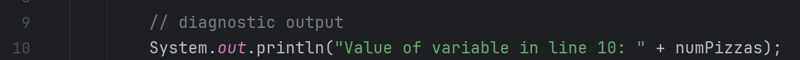
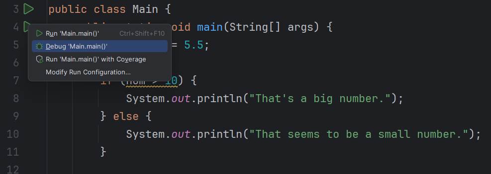
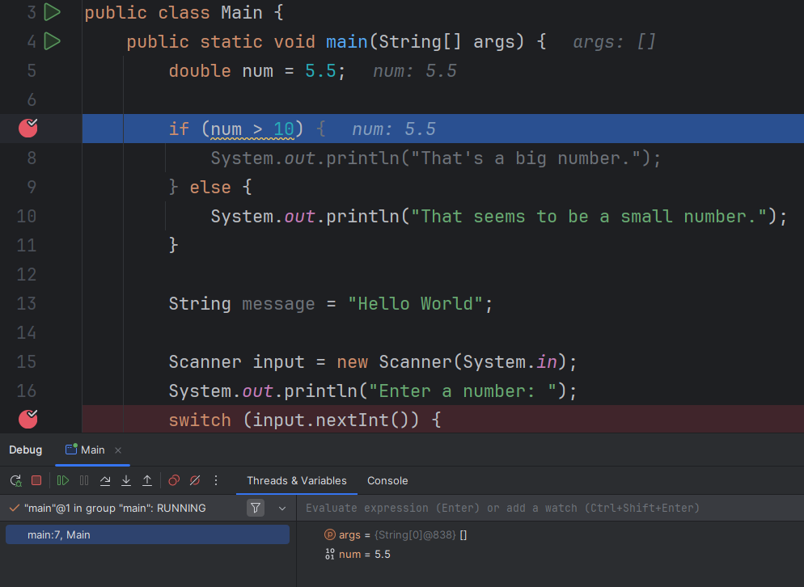

# Debugging I

Break points, Step Over

---

# Debugging

- Getting familiar with the debugging tools will be very helpful when using methods
- Also, getting familiar with the call stack will be vitally important in order to fully understand how methods work

--- 

# Have you ever done this?

- There’s a better way!!

---

# Breakpoints and Debug Mode

<!-- column -->

<!-- column -->

- Entering Debug Mode

---

# Breakpoints

- Program stop BEFORE the instruction at the breakpoint is executed
- You can add/remove breakpoints while in debug mode
- If you make any changes to the source code, you must recompile/restart debug mode

---

# Variable values

- Displayed inline in the source code
- Displayed in the “Threads & Variables” section on the bottom
- Console output is in a separate tab

<!-- column -->

<!-- column -->

---

# Debug Mode Controls

- Re-compile and start debug process again
- Stop
- Resume
    - Continue program until it encounters next breakpoint
- Pause
- Step over
    - Executes current instruction and stops before executing the next instruction
- Step in (more on this later)
- Step out (more on this later)

---
