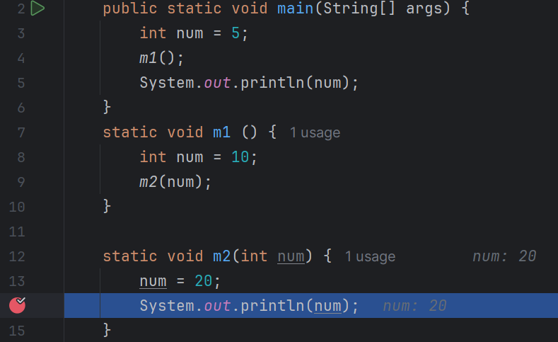
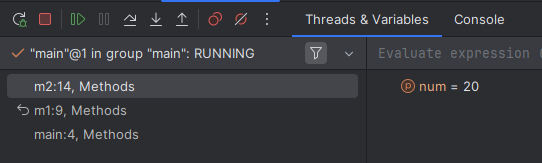
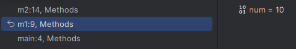
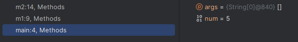

# Debugging II

Step In/Out, Stack Frames

---

# Methods

- Stepping in and out in debug mode has everything to do with the call stack
- The call stack organizes each method running in the program

---

# Step Over

---

# The Call Stack

> [Call Stacks - CS50 Shorts](https://youtu.be/aCPkszeKRa4?si=OXhrzydC9RdxnSy5)

---

# Example

---

# Stack Frames

<!-- column -->

<!-- column -->

## 3 Active Stack Frames
- main calls m1
- m1 calls m2

> Each stack frame has its own version of variable num

<!-- endcolumns -->

---

# Debug Mode Controls

- Step into
    - Will go into any methods in the next instruction
    - If there are multiple methods, debugger will prompt and ask which method to go into
    - Behaves the same as step over if there are no methods
- Step out
    - Will finish running current method and step out of current method
