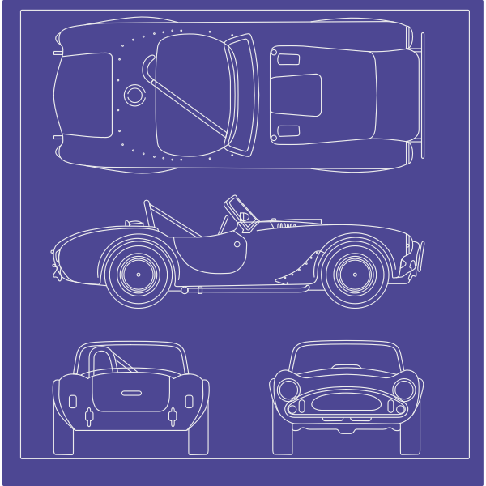

# Objects and Classes

---

# Object Oriented Programming
- OOP is a programming paradigm based on objects and classes.
- It helps in designing software using real-world concepts.
- Java is a fully object-oriented language (except for primitive types).

---

# Programming Paradigm
A programming paradigm is a fundamental style or approach to programming, guiding how code is structured and executed.

Purpose: Helps developers organize and solve problems effectively using specific principles and patterns.

Types: Different paradigms exist, each with unique ways of thinking about data and control flow.

Examples:
- Imperative (e.g., Procedural, Object-Oriented) – Focuses on step-by-step instructions.
- Declarative (e.g., Functional, Logic-based) – Focuses on what to achieve rather than how.

---

# OOP Paradigm
Object-Oriented Programming (OOP) helps in problem-solving by breaking down complex systems into smaller, reusable objects that represent real-world entities.

By using encapsulation, inheritance, and polymorphism, OOP promotes modularity, making code easier to manage, extend, and debug.

This approach allows developers to build scalable applications where different components interact efficiently while maintaining security and flexibility.

---

# Not everyone loves OOP, though
- Complexity & Overhead
- Performance Issues
- Rigid Structure
- Code Bloat
- Misuse of Inheritance
- Functional Programming Alternative

---

# “Pillars” of OOP
- Definition: Object-Oriented Programming (OOP) is a programming paradigm that is based on the concept of "objects."
- Four Main Pillars:
  - Encapsulation
  - Inheritance
  - Polymorphism
  - Abstraction

---

# Abstraction (Review)
Definition: Abstraction involves hiding the complexity of a system and exposing only the necessary parts.

Purpose: It allows focusing on essential features without dealing with the inner workings.

---

# Encapsulation
Definition: Encapsulation is the concept of bundling the data (variables) and methods (functions) that operate on the data into a single unit (class), and restricting access to some of the object's components.

---

# Benefits of OOP
- Modularity
- Code Reusability
- Maintainability

---

# Main two constructs: Classes and Objects
- Class: A blueprint for creating objects.
- Object: An instance of a class.

---

# Class
> A blueprint for a car



---

# An Object
> Created from the blueprint
> The actual "thing"


---

# Many instances/objects
> Blueprint can be reused

<!-- column -->


<!-- column -->


<!-- column -->


---

# Anatomy of a Simple Class


A class combines **state** (data) and **behavior** (methods).

## AKA - Some synonyms
<!-- column -->
- State
  - Data fields
  - Properties
  - Attributes
  - Members
  - Variables
<!-- column -->
- Behavior
  - Methods

---

# First Class Example

```java
public class Dog {
    String name;
    int age;

    void bark() {
        System.out.println("Woof!");
    }
}
```

### Class Components

- `Dog` = class name
- `name`, `age` = data fields (state)
- `bark()` = method (behavior)
- Blueprint for creating Dog objects

---

# Creating Objects

A class definition does not create an object.

Objects are created using the `new` keyword.

```java
Dog myDog = new Dog();
Dog yourDog = new Dog();
```

---
# Creating Objects

### Important

- `myDog` and `yourDog` are different objects
- Each object has its own copy of the fields
- Both objects were created from the same class blueprint

```text
Dog Class
     ↓
 ┌─────────┐
 │ myDog   │
 └─────────┘

 ┌─────────┐
 │ yourDog │
 └─────────┘
```

---

# Fields Store Object State

Each object keeps track of its own state.

<!-- column -->

```java
Dog myDog = new Dog();
Dog yourDog = new Dog();

myDog.name = "Buddy";
yourDog.name = "Max";

System.out.println(myDog.name);
System.out.println(yourDog.name);
```

<!-- column -->

### Output

```text
Buddy
Max
```

<!-- endcolumns -->

### Key Idea

Even though both objects are Dogs, their field values can be different.

---

# Methods Define Behavior

Methods describe what an object can do.

<!-- column -->

```java
public class Dog {
    String name;

    void bark() {
        System.out.println(name + " says Woof!");
    }
}
```

<!-- column -->

Using the method:

```java
Dog dog1 = new Dog();
dog1.name = "Buddy";

dog1.bark();
```

### Output

```text
Buddy says Woof!
```

<!-- endcolumns -->

### Key Idea

- Fields describe an object's **state**
- Methods describe an object's **behavior**

---

# Methods Can Use Object Data

Methods often work with the fields that belong to the object.

<!-- column -->

```java
public class BankAccount {
    double balance;

    void deposit(double amount) {
        balance += amount;
    }
}
```

<!-- column -->

Using the object:

```java
BankAccount account = new BankAccount();

account.balance = 100.00;
account.deposit(50.00);

System.out.println(account.balance);
```

### Output

```text
150.0
```

<!-- endcolumns -->

### Key Idea

Methods can read and modify an object's state.

---

# The `this` Keyword

Inside a class, `this` refers to the current object.

<!-- column -->

```java
public class Dog {
    String name;

    void introduce() {
        System.out.println("I am " + this.name);
    }
}
```

<!-- column -->

Using the method:

```java
Dog dog1 = new Dog();
dog1.name = "Buddy";

dog1.introduce();
```

### Output

```text
I am Buddy
```

<!-- endcolumns -->

### Key Idea

`this` means "the current object."

---

# Putting It Together

Classes group related data and behavior together.

<!-- column -->

```java
public class Student {
    String name;
    double gpa;

    void displayInfo() {
        System.out.println(name + " - GPA: " + gpa);
    }
}
```
<!-- column -->

Using the class:

```java
Student s1 = new Student();

s1.name = "Alex";
s1.gpa = 3.8;

s1.displayInfo();
```


### Output

```text
Alex - GPA: 3.8
```

---
