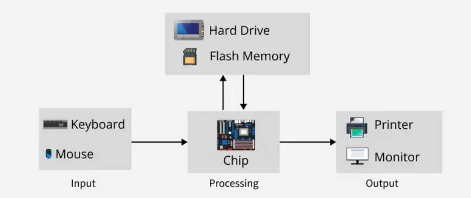
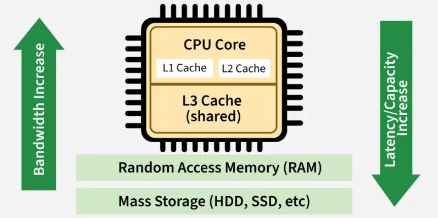
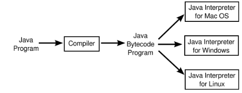
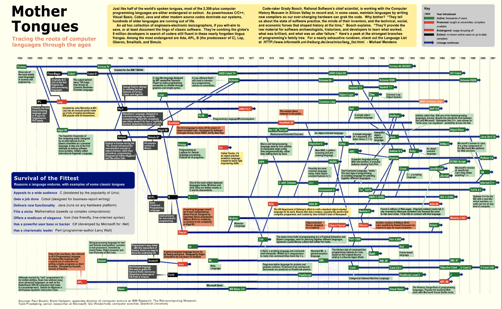

# Computers Review

---

# Review Computers

- CPU
- RAM
- Storage Devices (hard drives)
- Input
- Output
- Etc.

---

# Big Picture

<!-- footer -->

https://www.geeksforgeeks.org/computer-science-fundamentals/computer-memory/

---

# Memory Hierarchy

<!-- footer -->

https://www.geeksforgeeks.org/computer-science-fundamentals/computer-memory/

---

# Where is the program?

## How a Computer Program Runs: From Storage to Execution

### 1. Stored in Secondary Memory (Disk/SSD)

- Program files live here until you launch them.
- Permanent storage, but slow.

### 2. Loaded into Primary Memory (RAM)

- When you run the program, the OS loads its instructions and data into RAM.
- Faster than disk, but volatile.

---
# Where is the program? (continued)
### 3. Moved to CPU Cache

- Frequently accessed instructions/data are copied into cache for quick access.
- Very fast, but tiny.

### 4. Registers & Execution

- CPU pulls instructions from cache into registers.
- Registers hold data for immediate execution.
- Actual computation happens here.

---

# Algorithm Development

## Textbook Section 3.2

<!-- footer -->

https://math.hws.edu/javanotes/c3/s2.html

---

# Programming: Difficult but Rewarding

- Programming requires precision and attention to detail.
- Computers follow instructions exactly as written.
- Despite its difficulty, programming can be fun and fulfilling.

---

# What is an Algorithm?

- An algorithm is a step-by-step procedure to solve a task.
- It must be unambiguous and terminate after a finite number of steps.
- Algorithms can be expressed in any language, including English.

---

# Algorithm vs Program

- An algorithm is the idea behind the steps to solve a task.
- A program is the implementation of an algorithm in a programming language.
- Programs require all details to be filled in.

---

# Developing Algorithms

- Algorithms are developed through thought and practice.
- Skill in algorithm development improves with experience.
- Techniques and guidelines can assist in programming in the small.

---

# Writing a Program

## In general

---

# Telling the computer what to do...

- Machine Language
- Assembly Language
- High Level Language

---

# High-Level Languages

- Closer to human language (e.g., Python, Java, C#)
- Easier to read, write, and maintain
- Abstracts hardware details
- Requires a compiler or interpreter
- More portable across platforms

---

# Low-Level Languages

- Closer to machine language (e.g., Assembly, Machine Code)
- Harder to read and write
- Offers direct control over hardware
- Faster execution and more efficient
- Platform-dependent

---

# Source Code

A program written in a high-level language is called source code.

- Must be translated into machine code for execution.
- Translation is performed by an interpreter or compiler.

---

# Interpreters

- Read one statement from source code.
- Translate it into machine code or virtual machine code.
- Execute it immediately.

---

# Compilers

- Translate the entire source code into a machine-code file.
- The machine-code file is then executed.

---

# Compiling Java

- Source code can be recompiled for different machines.
- Java compiles into bytecode.
- Bytecode runs on any computer with a Java Virtual Machine (JVM).
- JVM interprets Java bytecode.

---

# Java Virtual Machine (JVM)

---

# Operating Systems

- OS manages and controls a computer’s activities.
- Examples: Microsoft Windows, macOS, Linux.
- Application programs require an operating system.

---

# Development Environment

We need a text editor, compiler, and JVM to write, compile, and execute Java programs.

- IntelliJ Community Edition (text editor)
- Java JDK (compiler, JVM/runtime environment)

---

# History of Programming Languages

<!-- footer -->
[History of Languages at cdslab.org](https://www.cdslab.org/python/notes/preliminary-foundations/programming-history/PLchart.png)

---

# Objects and Object Oriented Programming
## Textbook Section 1.5

<!-- footer -->

https://math.hws.edu/javanotes/c1/s5.html

---

# Importance of Program Design

- Programs must be designed before coding begins.
- Software engineering focuses on correct, working, and well-written programs.
- Design involves analyzing the problem and planning a solution.

---

# Structured Programming

- Popular in the 1970s and 80s.
- Break large problems into smaller pieces.
- Work on each piece separately.

---

# Top-Down Programming

- Solve a problem by decomposing it into sub-problems.
- Continue breaking down until problems can be solved directly.
- Useful but incomplete approach.

---

# Limitations of Top-Down Design

- Focuses mainly on instructions, not data structures.
- Designs are often unique to specific problems.
- Difficult to reuse components.

---

# Need for Reusable Components

- High-quality programs are difficult and expensive to produce.
- Reusing past work saves time and effort.
- Modern approaches emphasize modularity and reuse.

---

# Top-Down and Bottom-Up Design

- Top-down: break problems into smaller parts.
- Bottom-up: start with known solutions and reusable components.
- Combining both leads to more effective design.

---

# Modular Programming

- Modules interact with the system in a simple, defined way.
- Internal details are hidden.
- Promotes reusability and maintainability.

---

# Information Hiding

- Modules hide internal data and expose subroutines.
- Protects data and simplifies usage.
- Users interact through well-defined interfaces.

---

# Object-Oriented Programming (OOP)

- Objects contain data and subroutines.
- Objects respond to messages and manage their own state.
- Encourages modular, reusable, and intuitive design.

---

# OOP Methodology

- Identify objects and responsibilities.
- Design interactions through message passing.
- Reflects real-world modeling and improves clarity.

---

